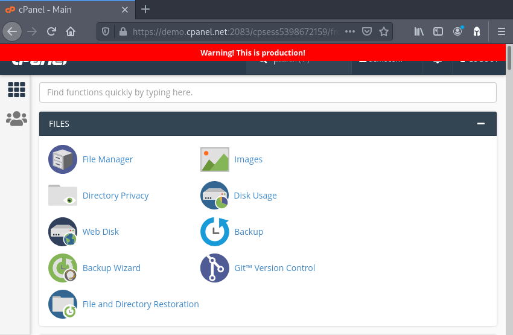
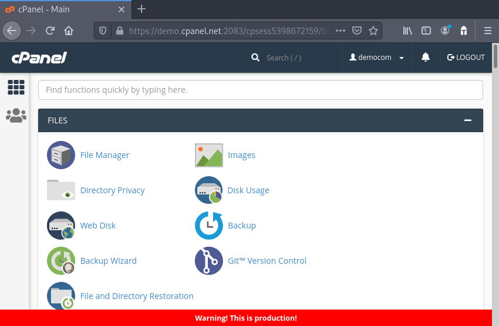
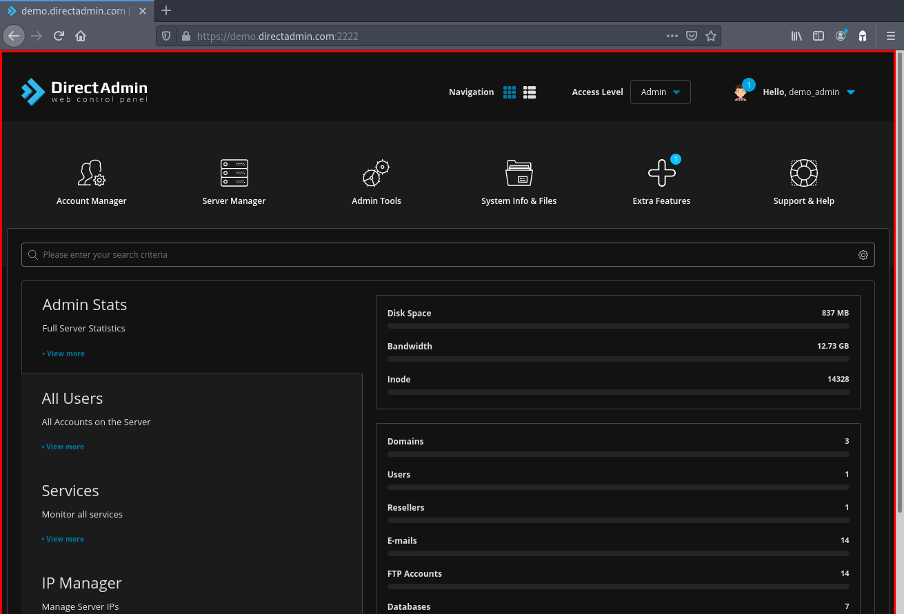
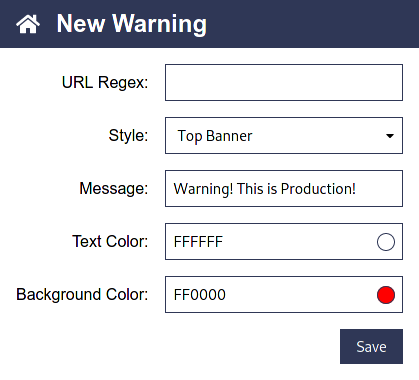

# Prod Guard


[](https://travis-ci.com/dotboris/prod-guard)
[](https://snyk.io/test/github/dotboris/prod-guard?targetFile=package.json)

A browser extension that lets you know when you're connected to production by
giving you a clear visual warning. Never accidentally make changes to
production.

Specifically, Prog Guard lets you add big red warnings to any website.

## Install

TODO: publish extension & give links here

## Showcase

What follows are the available warnings that can be shown on websites.

<table>
  <tr>
    <th>Top Banner</th>
    <th>Bottom Banner</th>
    <th>Border</th>
  </tr>
  <tr>
    <td></td>
    <td></td>
    <td></td>
  </tr>
</table>

## Usage

Adding a warning to a site is very simple.

1.  Open click on the Prod Guard icon in your browser to open the settings.

    

1.  Click on __New Warning__ in the top right corner.

1.  Fill in the details for the site of your choice.

    

    __URL Pattern__ is a regular expression that matches the URL of the website.
    This lets you match the host, port, path, scheme, etc.

    __Style__ is the type of warning that will be shown. Examples are shown
    above.

1.  Click on __Save__.

1.  Open or refresh the page you want to see a warning on. You should now see a
    warning.

## Development

### Build

```sh
yarn build
# or
yarn build:prod
```

### Run

1. In one terminal start the watch build

    ```sh
    yarn build:watch
    ```

1. In another terminal start a browser with the extension loaded

    ```sh
    yarn start
    ```

### Test

```sh
# Watch
yarn test
# Single run
yarn test --single-run
```

### Lint

```sh
yarn build
yarn lint
```

## Release

1.  Checkout `master` and make sure that you have a clean environment.
1.  Update the [changelog](CHANGELOG.md)

    You'll need to change the `Unreleased` section to the version you're about
    to release and create a new empty `Unreleased` section.

    Once that's done, commit this change directly to `master`.

1.  Bump the version.

    ```sh
    yarn version
    ```

1.  Push your version bump and changelog update.

    ```sh
    git push --tags origin master
    ```

1.  Build & package the extension.

    ```sh
    yarn build:prod
    yarn package
    ```

1.  Upload the packaged extension to the Firefox add-ons site.

    Note that the previous step created a packaged extension for you to upload
    in `web-ext-artifacts/`. Make sure that you're uploading the right version!
